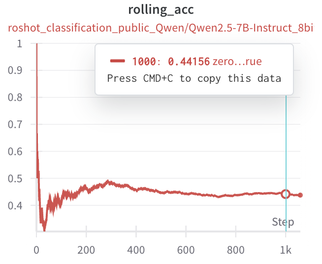

# Can LLM learn with incoming streams of questions?
Welcome to the ADL final project! This guide will help you set up your environment, prepare the datasets, and implement your LLM agent. Please read through all instructions carefully.

**(New Feature)** Run with `wandb` to visualize the performance curves during streaming! See the corresponding [section](#recommended-use-weights--biases-to-track-your-experiments) for how to use it.


## Step 1: Setup Environment

Ensure you have Python 3.10 or above installed on your system. You can check your Python version by running:

```
python --version
$ Python 3.10.12
```

If you need to update Python, visit the [official Python website](https://www.python.org/downloads/).

Next, it's recommended to create a virtual environment:

```
python -m venv venv
source venv/bin/activate  # On Windows, use `venv\Scripts\activate`
```

Then, install the required packages:

```
pip install -r requirements.txt
```

## Step 2: Setup Dataset

Run the following command to set up the necessary datasets:

```
python setup_data.py
```

This script will download and prepare all required data for the project. Ensure you have a stable internet connection and sufficient disk space.

## Step 3: Check Your Environment

After setting up the datasets and installing the required packages, it's crucial to verify your environment:

```
python test_env.py
```

You should see each task marked as PASSED when evaluated on ground truth data. For example:

```
Task: sql_generation_public
Metric: EX
Score: 0.9993 (score > 0.99)
Result: PASSED
------------------------------
```

If any task fails, double-check your setup and ensure all datasets are correctly placed.

## Write Your Agent Code in `main.py`

### Introduction to Agent Code:

Your task is to implement AI agents in the `main.py` file. There are two types of agents you need to implement: `ClassificationAgent` and `SQLGenerationAgent`. You need to implement at least three methods:
1. `__init__(self, config: dict) -> None`: Initialize your LLM agent with the given configuration.
   - This method should set up any necessary components for your agent, such as the language model, memory, or other resources.
   - The `config` dictionary may contain parameters like model name, API keys, or other settings.

2. `__call__(self, *args) -> str`: This is the main method for generating predictions or responses.
   - For `ClassificationAgent`, it takes `label2desc: dict[str, str]` and `text: str` as arguments.
   - For `SQLGenerationAgent`, it takes `table_schema: str` and `user_query: str` as arguments.
   - This method should return the predicted label (for classification) or generated SQL code (for SQL generation).

3. `update(self, correctness: bool) -> bool`: Update the agent based on feedback about its performance.
   - This method is called after each prediction to provide feedback on whether the agent's output was correct.
   - Use this method to implement learning or adaptation strategies for your agent.
   - Return `True` if the agent was updated, `False` otherwise.

These methods form the core of your agent's functionality. Implement them carefully, considering the specific requirements of each task (classification or SQL generation) and any learning or adaptation strategies you want to incorporate.

### Example Implementations:

To help you get started, we've provided some example implementations: (you may use the `--debug` flag to test whether the example agent is working properly)

1. Zero-shot Agent (non-streaming baseline, each question solved independently):
   ```
   python -m examples.zeroshot --bench_name classification_public --model_name <model_name> --device <device> --output_path <path_to_save_csv>
   python -m examples.zeroshot --bench_name sql_generation_public --model_name <model_name> --device <device> --output_path <path_to_save_csv>
   ```

2. Self-Streaming In-Context Learning (Self-StreamICL) Agent:
   ```
   python -m examples.self_streamicl --bench_name classification_public --model_name <model_name> --device <device> --output_path <path_to_save_csv>
   python -m examples.self_streamicl --bench_name sql_generation_public --model_name <model_name> --device <device> --output_path <path_to_save_csv>
   ```

3. Multi-Agentic-Memory Round-Robin (MAM-StreamICL) Agent:
   Work in progress (WIP)

These examples demonstrate different approaches to agent implementation:
- The ZeroShot Agent solves each question independently without learning from previous interactions.
- The Self-Streaming In-Context Learning Agent uses a RAG (Retrieval-Augmented Generation) approach to learn and improve its performance over time.

Study these examples to understand different strategies for implementing your own agent.

### (Recommended) Use Weights & Biases to Track Your Experiments

You can use Weights & Biases (`wandb`) to track your experiments. The `wandb` library will visualize the streaming performance over time, so you can easily compare the performance curves of different agents (see the figure below).



To use `wandb`, you can simply add the `--use_wandb` flag to your command. (Remember to login to `wandb` first by running `wandb login` in the terminal.)
```
python -m examples.zeroshot --use_wandb --bench_name <bench_name> --model_name <model_name> --device <device> --output_path <path_to_save_csv>
```

## How to Submit

1. Implement your two agents in `main.py`.
2. Test your implementation with different datasets:
   ```
   python main.py --bench_name "classification_public" --output_path <path_to_save_csv>
   python main.py --bench_name "sql_generation_public" --output_path <path_to_save_csv>
   ```
   Replace `dataset_name` with the specific dataset you want to test (e.g., 'bird', 'spider', etc.).
3. Ensure your code runs without errors and produces expected outputs.
4. Submit the csv files you've created to the Kaggle competition pages.

## Additional Tips

- Make sure to comment your code thoroughly.
- Test your agent on all provided datasets to ensure broad compatibility.
- Pay attention to the different prompt types provided in the `__call__` method. Experiment with using them effectively.
- The `update` method is crucial for implementing learning capabilities in your agent. Consider how you can use feedback to improve performance over time.
- Don't hesitate to ask questions if you're stuck or need clarification on any part of the project.

Good luck with your implementation!

# TODOs
- [ ] Implement the MAM-StreamICL example agent
